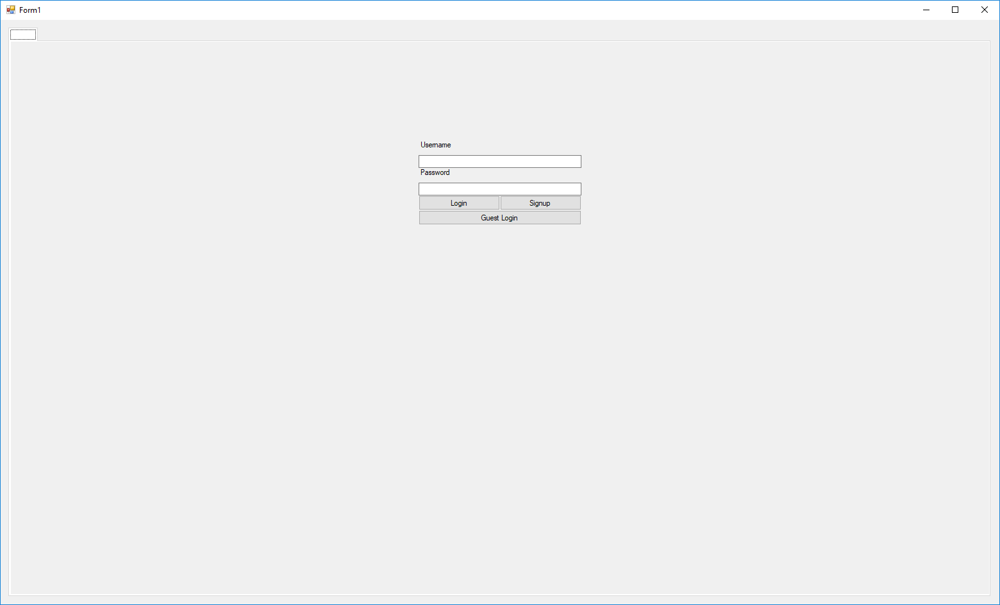
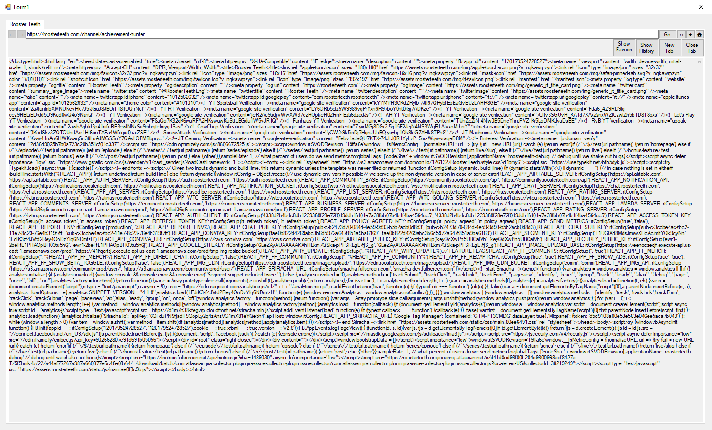
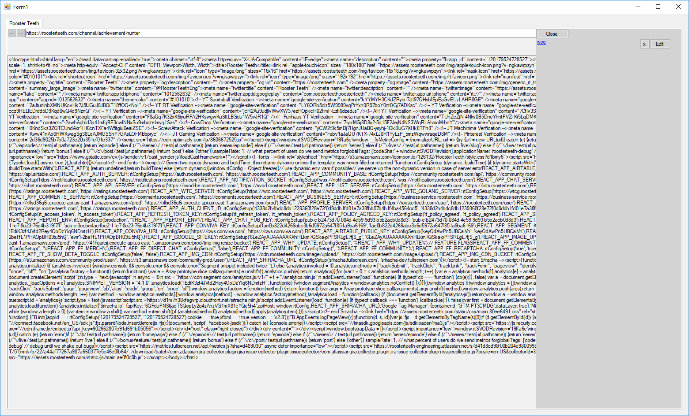

# HTML Viewer
## About
This project was created for my industrial programming module in 4th year. I got a 74% mark for this project and a 70% mark for the module over all. The aim of the project was to create a web browser that would send html requests and then retrieve the html to display the page or the error code if something went wrong. The browser also had to be able to to store history and favourites. I added user functionality which was not a requirement but allowed users to have individual histories and favourites lists.

### Technology used
* C#
* Visual studio

### Running The Application
To run the application please run the solution file in visual studio 2015

## Login page

Users can login using user accounts or they could sign in as guest. The guest and other user accounts have their own individualised favourites and histories.

## Viewer

With this section the user can enter a url into the url bar and load the html. They can also favourite it and move bckwards and forwards as well as add tabs. Each tab has its own thread to allow multitasking within the application.

## History and Favourites Panel

There are panels that store the histories and the favourites. Thefavourites panel allows for the name of the link to be changed.